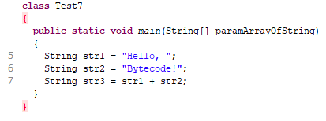
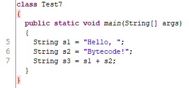

# 1. OpenJdk 설치

## yum(Yellowodg updater, Modified)
- CentOS, Fedora, RHEL(Red Hat Enterprise Linux)
- 레드헷 계열 리눅스의 패키지 관리 도구

## apt-get(Advanced Packaging Tool)
- 우분투
- 데비안 계열 리눅스의 패키지 관리 도구

<br />

# 2. JRE 와 JDK
## JRE(Java Runtime Environment)
- 자바 애플리케이션 실행을 위한 환경을 제공

## JDK(Java Development Kit)
- JRE + javac 컴파일러 + 유용한 유틸리티

<br />

# 3. JVM(Java Virtual Machine)
- Write Once, Run Anywhere
- java 확장자의 소스를 컴파일 하면 class 확장자의 파일이 생성
- bytecode로 작성
- 하드웨어적 특성이나 OS특성에 독립적인 파일
- JVM은 이 bytecode를 인터프린트하여 실행

<br />

# 4. 기동모드
## java -server
- slow startup, more complete compilation,The compiler is an adaptive compiler,High efficiency, optimized for server applications,Designed to maximize program execution speed in a server environment.

## java -client
- Quick start,Small memory footprint,Compile fast, optimized for desktop applications,Optimized to reduce startup time in the client environment

<br />

# 5. Runtime Data Area
- JVM의 자바애플리케이션 실행을 위한 메모리 영역
- 개별 공간 : Register, JVM Stack, Native Method Stack
- 공유 공간 : Method Area, Heap

## Register
- 32bit(=JVM 1 word)
- data, address, status
- PC(Program Counter) Register
- optop Register -> Operand Stack
- vars Register -> Local Variable
- frame Register -> Execution Environment

## JVM Stack
- Stack = Frame's
- Operand Stack
   - slot(32bit, 1 word)
   - long, double => 2slot
- Local Variable
   - slot(32bit, 1 word)
   - boolean, byte, char, short, int, float 등 primitive type => 1slot
   - long, double => 2slot
   - Object, String => Heap에 저장되고 reference만 Local Variable에 저장
- Excution Environment
   - Dynamic Linking(동적 링킹)
   - 리턴값
   - Exception
- 특정 Thread가 최대 Stack 크기 이상으로 메서드를 생성, 호출 => StackOverflowError
- 여유 메모리가 충분하지 못해 Stack 자체를 생성하지 못하면 => OutOfMemoryError

## Native Method Stack
- C언어 등 타 언어 코드 실행

## Method Area
- Classloader Reference
- Runtime Constant Pool
- Field Information
- Method Information
- Method Code
- 각 객체의 address를 Resolution

## Heap
- 이후 설명

<br />

# 6. bytecode
- 바이너리 파일
- JVM상에서 실행

<br />

# 역어셈블 예제 1
```java
// Test.java
class Test 
{
    public static void main(String[] args)
    {
        System.out.println("안녕");
    }
}
```
`\> javac Test.java`
<br>
`\> javap -c Test.class`

```java
Compiled from "Test.java"
class Test {
  Test();   
    Code:   
       0: aload_0
       1: invokespecial #1                  // Method java/lang/Object."<init>":()V
       4: return

  public static void main(java.lang.String[]);
    Code:
       0: getstatic     #2                  // Field java/lang/System.out:Ljava/io/PrintStream;        
       3: ldc           #3                  // String ȳ
       5: invokevirtual #4                  // Method java/io/PrintStream.println:(Ljava/lang/String;)V
       8: return
}
```
- 암시적으로 기본 생성자가 생성
- aload_0 : Local Variable slot 0의 reference를 로드(args or this)
- invokespecial : 생성자나 인스턴스 메서드를 호출
   - invokestatic : static 클래스 메서드 호출
   - invokeinterface : 인터페이스 메서드 호출
   - invokevirtual : 인스턴스 메서드 호출

# 역어셈블 예제 2
```java
// Test2.java
class Test2 
{
    public static void main(String[] args)
    {
        int i1 = 1;
        int i2 = 3;
        int i3 = 10;
    }
}
```
`\> javac Test2.java`
<br>
`\> javap -c Test2.class`

```java
Compiled from "Test2.java"
class Test2 {
  Test2();
    Code:
       0: aload_0
       1: invokespecial #1                  // Method java/lang/Object."<init>":()V
       4: return

  public static void main(java.lang.String[]);
    Code:
       0: iconst_1
       1: istore_1
       2: iconst_3
       3: istore_2
       4: bipush        10
       6: istore_3
       7: return
}
```
- iconst_1 : i는 int를 의미하며 int 1을 Operand Stack에 push
- istore_1 : Operand Stack의 int 1을 Local Variable slot 1에 pop
- iconst_3 : int 3을 Operand Stack에 push
- istore_2 : Operand Stack의 int 3을 Local Variable slot 2에 pop
- bipush 10 : int 10을 Operand Stack에 push
- istore_3 : Operand Stack의 int 10을 Local Variable slot 3에 pop

# 역어셈블 예제 3
```java
// Test2_2.java
class Test2_2
{
    public static void main(String[] args)
    {
        int im2 = -2;
        int im1 = -1;
        int i1 = 1;
        int i2 = 2;
        int i3 = 3;
        int i4 = 4;
        int i5 = 5;
        int i6 = 6;
        int i7 = 7;
        int i8 = 8;
        int i9 = 9;
        int i10 = 10;
    }
}
```
`\> javac Test2_2.java`
<br>
`\> javap -c Test2_2.class`

```java
Compiled from "Test2_2.java"
class Test2_2 {
  Test2_2();
    Code:
       0: aload_0
       1: invokespecial #1                  // Method java/lang/Object."<init>":()V
       4: return

  public static void main(java.lang.String[]);
    Code:
       0: bipush        -2
       2: istore_1
       3: iconst_m1
       4: istore_2
       5: iconst_1
       6: istore_3
       7: iconst_2
       8: istore        4
      10: iconst_3
      11: istore        5
      13: iconst_4
      14: istore        6
      16: iconst_5
      17: istore        7
      19: bipush        6
      21: istore        8
      23: bipush        7
      25: istore        9
      27: bipush        8
      29: istore        10
      31: bipush        9
      33: istore        11
      35: bipush        10
      37: istore        12
      39: return
}
```
- -1~5까지는 iconst_x 형식을 쓰고, 그 외 int는 bipush 형태를 사용

# 역어셈블 예제 4
```java
// Test3.java
class Test3
{
    public static void main(String[] args)
    {
        int i1 = 1;
        int i2 = 10;
        long l1 = 3L;
        long l2 = 100L;
        short s1 = 11;
        short s2 = 12;
        byte b1 = 15;
        byte b2 = 16;
        char c1 = 'a';
        char c2 = 'b';        
        float f1 = 0.1f;
        float f2 = -0.5f;
        double d1 = 0.111;
        double d2 = -0.555;
    }
}
```
`\> javac Test3.java`
<br>
`\> javap -c Test3.class`

```java
Compiled from "Test3.java"
class Test3 {
  Test3();
    Code:
       0: aload_0
       1: invokespecial #1                  // Method java/lang/Object."<init>":()V
       4: return

  public static void main(java.lang.String[]);
    Code:
       0: iconst_1
       1: istore_1
       2: bipush        10
       4: istore_2
       5: ldc2_w        #2                  // long 3l
       8: lstore_3
       9: ldc2_w        #4                  // long 100l
      12: lstore        5
      14: bipush        11
      16: istore        7
      18: bipush        12
      20: istore        8
      22: bipush        15
      24: istore        9
      26: bipush        16
      28: istore        10
      30: bipush        97
      32: istore        11
      34: bipush        98
      36: istore        12
      38: ldc           #6                  // float 0.1f
      40: fstore        13
      42: ldc           #7                  // float -0.5f
      44: fstore        14
      46: ldc2_w        #8                  // double 0.111d
      49: dstore        15
      51: ldc2_w        #10                 // double -0.555d
      54: dstore        17
      56: return
}
```
- iconst, bipush : int, char, short type이 Operand Stack에 push
- lconst : long type이 Operand Stack에 push
- ldc, ldc_w, ldc2_w : Constant Pool 내 인덱스에 해당하는 Constan를 Operand Stack에 push
- long, double type의 경우 64bit(2 word)를 사용하므로 Local variable slot을 2개 사용 

# 역어셈블 예제 5
```java
// Test5.java
class Test5
{
    public static void main(String[] args)
    {
        int i1 = 1;
        int i2 = 3;
        int i3 = 10;
        int i4 = i1 + i2 + i3;
    }
}
```
`\> javac Test5.java`
<br>
`\> javap -c Test5.class`

```java
Compiled from "Test5.java"
class Test5 {
  Test5();
    Code:
       0: aload_0
       1: invokespecial #1                  // Method java/lang/Object."<init>":()V
       4: return

  public static void main(java.lang.String[]);
    Code:
       0: iconst_1
       1: istore_1
       2: iconst_3
       3: istore_2
       4: bipush        10
       6: istore_3
       7: iload_1
       8: iload_2
       9: iadd
      10: iload_3
      11: iadd
      12: istore        4
      14: return
}
```
- iload_1 : Local Variable slot 1의 int 1을 Operand Stack에 push
- iload_2 : Local Variable slot 2의 int 3을 Operand Stack에 push
- iadd : Operand Stack의 두 int 1, int 3을 add
- iload_3 : Local Variable slot 3의 int 10을 Operand Stack에 push
- iadd : Operand Stack의 두 int 4, int 10을 add
- istore 4 : Operand Stack의 int 14를 Local Variable slot 4에 pop

# 역어셈블 예제 6
```java
// Test6.java
class Test6
{
    public static void main(String[] args)
    {
        String s1 = "Hello, ";
        String s2 = "Bytecode!";
    }
}
```
`\> javac Test6.java`
<br>
`\> javap -c Test6.class`

```java
Compiled from "Test6.java"
class Test6 {
  Test6();
    Code:
       0: aload_0
       1: invokespecial #1                  // Method java/lang/Object."<init>":()V
       4: return

  public static void main(java.lang.String[]);
    Code:
       0: ldc           #2                  // String Hello,
       2: astore_1
       3: ldc           #3                  // String Bytecode!
       5: astore_2
       6: return
}
```
- ldc #2 : Constant Pool의 인덱스 #2 Constant를 Operand Stack에 push
- astore_1 : Operand Stack의 reference는 Local variable slot 1에 pop
- idc #3 : Constant Pool의 인덱스 #3 Constant를 Operand Stack에 push
- astore_2 : Operand Stack의 reference는 Local variable slot 2에 pop

# 역어셈블 예제 7
```java
// Test7.java
class Test7
{
    public static void main(String[] args)
    {
        String s1 = "Hello, ";
        String s2 = "Bytecode!";
        String s3 = s1 + s2;
    }
}
```
`\> javac Test7.java`
<br>
`\> javap -c Test7.class`

```java
Compiled from "Test7.java"
class Test7 {
  Test7();
    Code:
       0: aload_0
       1: invokespecial #1                  // Method java/lang/Object."<init>":()V
       4: return

  public static void main(java.lang.String[]);
    Code:
       0: ldc           #2                  // String Hello,
       2: astore_1
       3: ldc           #3                  // String Bytecode!
       5: astore_2
       6: new           #4                  // class java/lang/StringBuilder
       9: dup
      10: invokespecial #5                  // Method java/lang/StringBuilder."<init>":()V
      13: aload_1
      14: invokevirtual #6                  // Method java/lang/StringBuilder.append:(Ljava/lang/String;)Ljava/lang/StringBuilder;
      17: aload_2
      18: invokevirtual #6                  // Method java/lang/StringBuilder.append:(Ljava/lang/String;)Ljava/lang/StringBuilder;
      21: invokevirtual #7                  // Method java/lang/StringBuilder.toString:()Ljava/lang/String;
      24: astore_3
      25: return
}
```
- String + String을 처리하기 위해 자동으로 내부적으로 StringBuilder를 사용

`\>javap -verbose Test7.class`
```java
Classfile /C:/Users/hjoon/vs_workspace/tomcat_story/Test7.class
  Last modified 2021. 5. 22; size 465 bytes
  MD5 checksum 1a451ca6c229a8848ff309ff88e6388e
  Compiled from "Test7.java"
class Test7
  minor version: 0
  major version: 52
  flags: ACC_SUPER
Constant pool:
   #1 = Methodref          #9.#18         // java/lang/Object."<init>":()V
   #2 = String             #19            // Hello,
   #3 = String             #20            // Bytecode!
   #4 = Class              #21            // java/lang/StringBuilder
   #5 = Methodref          #4.#18         // java/lang/StringBuilder."<init>":()V
   #6 = Methodref          #4.#22         // java/lang/StringBuilder.append:(Ljava/lang/String;)Ljava/lang/StringBuilder;
   #7 = Methodref          #4.#23         // java/lang/StringBuilder.toString:()Ljava/lang/String;
   #8 = Class              #24            // Test7
   #9 = Class              #25            // java/lang/Object
  #10 = Utf8               <init>
  #11 = Utf8               ()V
  #12 = Utf8               Code
  #13 = Utf8               LineNumberTable
  #14 = Utf8               main
  #15 = Utf8               ([Ljava/lang/String;)V
  #16 = Utf8               SourceFile
  #17 = Utf8               Test7.java
  #18 = NameAndType        #10:#11        // "<init>":()V
  #19 = Utf8               Hello,
  #20 = Utf8               Bytecode!
  #21 = Utf8               java/lang/StringBuilder
  #22 = NameAndType        #26:#27        // append:(Ljava/lang/String;)Ljava/lang/StringBuilder;
  #23 = NameAndType        #28:#29        // toString:()Ljava/lang/String;
  #24 = Utf8               Test7
  #25 = Utf8               java/lang/Object
  #26 = Utf8               append
  #27 = Utf8               (Ljava/lang/String;)Ljava/lang/StringBuilder;
  #28 = Utf8               toString
  #29 = Utf8               ()Ljava/lang/String;
{
  Test7();
    descriptor: ()V
    flags:
    Code:
      stack=1, locals=1, args_size=1
         0: aload_0
         1: invokespecial #1                  // Method java/lang/Object."<init>":()V
         4: return
      LineNumberTable:
        line 1: 0

  public static void main(java.lang.String[]);
    descriptor: ([Ljava/lang/String;)V
    flags: ACC_PUBLIC, ACC_STATIC
    Code:
      stack=2, locals=4, args_size=1
         0: ldc           #2                  // String Hello,
         2: astore_1
         3: ldc           #3                  // String Bytecode!
         5: astore_2
         6: new           #4                  // class java/lang/StringBuilder
         9: dup
        10: invokespecial #5                  // Method java/lang/StringBuilder."<init>":()V
        13: aload_1
        14: invokevirtual #6                  // Method java/lang/StringBuilder.append:(Ljava/lang/String;)Ljava/lang/StringBuilder;
        17: aload_2
        18: invokevirtual #6                  // Method java/lang/StringBuilder.append:(Ljava/lang/String;)Ljava/lang/StringBuilder;
        21: invokevirtual #7                  // Method java/lang/StringBuilder.toString:()Ljava/lang/String;
        24: astore_3
        25: return
      LineNumberTable:
        line 5: 0
        line 6: 3
        line 7: 6
        line 8: 25
}
SourceFile: "Test7.java"
```
- -v or -verbose : Print additional information
- Constant Pool의 정보, Flag, Stack, Local Variable, parameter 등 추가적인 정보 제공
- stack : 해당 메서드의 Operand Stack의 크기
- locals : Local variable 배열의 길이, slot의 수
- args_size : 파라미터의 수, 인스턴스의 메서드는 암시적으로 this 혹은 args를 포함하고 있기 때문에 +1
- flags : 클래스나 메서드 필드 등의 속성

|Flag Name|Value|Interpretation |
|------|---|---|
|ACC_PUBLIC|0x0001|Declared public; may be accessed from outside its package.|
|ACC_FINAL|0x0010|Declared final; no subclasses allowed.|
ACC_SUPER|	0x0020|	Treat superclass methods specially when invoked by the invokespecial instruction.|
|ACC_INTERFACE|	0x0200|	Is an interface, not a class.|
|ACC_ABSTRACT	|0x0400|	Declared abstract; must not be instantiated.|
|ACC_SYNTHETIC	|0x1000|	Declared synthetic; not present in the source code.|
|ACC_ANNOTATION	|0x2000	|Declared as an annotation type.|
|ACC_ENUM	|0x4000	|Declared as an enum type.|

`\>javap -l -c Test7.class`
<br>
- Print line number and local variable tables
```java
Compiled from "test7.java"
class Test7 {
  Test7();
    Code:
       0: aload_0
       1: invokespecial #1                  // Method java/lang/Object."<init>":()V
       4: return
    LineNumberTable:
      line 1: 0

  public static void main(java.lang.String[]);
    Code:
       0: ldc           #2                  // String Hello,
       2: astore_1
       3: ldc           #3                  // String Bytecode!
       5: astore_2
       6: new           #4                  // class java/lang/StringBuilder
       9: dup
      10: invokespecial #5                  // Method java/lang/StringBuilder."<init>":()V
      13: aload_1
      14: invokevirtual #6                  // Method java/lang/StringBuilder.append:(Ljava/lang/String;)Ljava/lang/StringBuilder;
      17: aload_2
      18: invokevirtual #6                  // Method java/lang/StringBuilder.append:(Ljava/lang/String;)Ljava/lang/StringBuilder;
      21: invokevirtual #7                  // Method java/lang/StringBuilder.toString:()Ljava/lang/String;
      24: astore_3
      25: return
    LineNumberTable:
      line 5: 0
      line 6: 3
      line 7: 6
      line 8: 25
}
```
- 일반적으로 컴파일 했을 경우 지역변수 명(Local Variable Table)은 날라간다.
- 디컴파일러 툴로 보면 임의의 지역 변수명이 정해진 것을 알 수 있다.



`\>javac -g Test7.java`
```
  -g                         Generate all debugging info
  -g:none                    Generate no debugging info
  -g:{lines,vars,source}     Generate only some debugging info
```
`\>javap -l -c Test7.class`
```java
Compiled from "Test7.java"
class Test7 {
  Test7();
    Code:
       0: aload_0
       1: invokespecial #1                  // Method java/lang/Object."<init>":()V
       4: return
    LineNumberTable:
      line 1: 0
    LocalVariableTable:
      Start  Length  Slot  Name   Signature
          0       5     0  this   LTest7;

  public static void main(java.lang.String[]);
    Code:
       0: ldc           #2                  // String Hello,
       2: astore_1
       3: ldc           #3                  // String Bytecode!
       5: astore_2
       6: new           #4                  // class java/lang/StringBuilder
       9: dup
      10: invokespecial #5                  // Method java/lang/StringBuilder."<init>":()V
      13: aload_1
      14: invokevirtual #6                  // Method java/lang/StringBuilder.append:(Ljava/lang/String;)Ljava/lang/StringBuilder;
      17: aload_2
      18: invokevirtual #6                  // Method java/lang/StringBuilder.append:(Ljava/lang/String;)Ljava/lang/StringBuilder;
      21: invokevirtual #7                  // Method java/lang/StringBuilder.toString:()Ljava/lang/String;
      24: astore_3
      25: return
    LineNumberTable:
      line 5: 0
      line 6: 3
      line 7: 6
      line 8: 25
    LocalVariableTable:
      Start  Length  Slot  Name   Signature
          0      26     0  args   [Ljava/lang/String;
          3      23     1    s1   Ljava/lang/String;
          6      20     2    s2   Ljava/lang/String;
         25       1     3    s3   Ljava/lang/String;
}
```
- 컴파일 할 때 옵션을 -g를 주게 되면 LocalVariableTable도 같이 저장
- 디컴파일러 툴로 봤을 때 지역 변수명도 복구가 된다.




# 클래스 파일 정보

|아이템|크기|
|------|----|
| magic |u4            | 
| minor_version | u2            |
| major_version |u2            |
| constant_pool_count |u2            |
| cp_info | constant_pool[constant_pool_count-1]      |
| access_flags |u2            |
| this_class |u2            |
| super_class |u2            |
| interfaces_count |u2            |
| interface_info |interfaces[interfaces_count]            |
| fields_count |u2            |
| field_info|fields[fields_count]     |
| methods_count |u2            |
| method_info | methods[methods_count]  |
| attributes_count |u2            |
| attribute_info| attributes[attributes_count] |

`/> javap -v Test7.class`
```java
  Last modified 2021. 5. 22; size 634 bytes
  MD5 checksum 2b832806bb4dba0b4abbaf4e472883d7
  Compiled from "Test7.java"
class Test7
  minor version: 0
  major version: 52
  flags: ACC_SUPER
Constant pool:
   #1 = Methodref          #9.#27         // java/lang/Object."<init>":()V
   #2 = String             #28            // Hello,
   #3 = String             #29            // Bytecode!
   #4 = Class              #30            // java/lang/StringBuilder
   #5 = Methodref          #4.#27         // java/lang/StringBuilder."<init>":()V
   #6 = Methodref          #4.#31         // java/lang/StringBuilder.append:(Ljava/lang/String;)Ljava/lang/StringBuilder;
   #7 = Methodref          #4.#32         // java/lang/StringBuilder.toString:()Ljava/lang/String;
   #8 = Class              #33            // Test7
   #9 = Class              #34            // java/lang/Object
  #10 = Utf8               <init>
  #11 = Utf8               ()V
  #12 = Utf8               Code
  #13 = Utf8               LineNumberTable
  #14 = Utf8               LocalVariableTable
  #15 = Utf8               this
  #16 = Utf8               LTest7;
  #17 = Utf8               main
  #18 = Utf8               ([Ljava/lang/String;)V
  #19 = Utf8               args
  #20 = Utf8               [Ljava/lang/String;
  #21 = Utf8               s1
  #22 = Utf8               Ljava/lang/String;
  #23 = Utf8               s2
  #24 = Utf8               s3
  #25 = Utf8               SourceFile
  #26 = Utf8               Test7.java
  #27 = NameAndType        #10:#11        // "<init>":()V
  #28 = Utf8               Hello,
  #29 = Utf8               Bytecode!
  #30 = Utf8               java/lang/StringBuilder
  #31 = NameAndType        #35:#36        // append:(Ljava/lang/String;)Ljava/lang/StringBuilder;
  #32 = NameAndType        #37:#38        // toString:()Ljava/lang/String;
  #33 = Utf8               Test7
  #34 = Utf8               java/lang/Object
  #35 = Utf8               append
  #36 = Utf8               (Ljava/lang/String;)Ljava/lang/StringBuilder;
  #37 = Utf8               toString
  #38 = Utf8               ()Ljava/lang/String;
{
  Test7();
    descriptor: ()V
    flags:
    Code:
      stack=1, locals=1, args_size=1
         0: aload_0
         1: invokespecial #1                  // Method java/lang/Object."<init>":()V
         4: return
      LineNumberTable:
        line 1: 0
      LocalVariableTable:
        Start  Length  Slot  Name   Signature
            0       5     0  this   LTest7;

  public static void main(java.lang.String[]);
    descriptor: ([Ljava/lang/String;)V
    flags: ACC_PUBLIC, ACC_STATIC
    Code:
      stack=2, locals=4, args_size=1
         0: ldc           #2                  // String Hello,
         2: astore_1
         3: ldc           #3                  // String Bytecode!
         5: astore_2
         6: new           #4                  // class java/lang/StringBuilder
         9: dup
        10: invokespecial #5                  // Method java/lang/StringBuilder."<init>":()V
        13: aload_1
        14: invokevirtual #6                  // Method java/lang/StringBuilder.append:(Ljava/lang/String;)Ljava/lang/StringBuilder;
        17: aload_2
        18: invokevirtual #6                  // Method java/lang/StringBuilder.append:(Ljava/lang/String;)Ljava/lang/StringBuilder;
        21: invokevirtual #7                  // Method java/lang/StringBuilder.toString:()Ljava/lang/String;
        24: astore_3
        25: return
      LineNumberTable:
        line 5: 0
        line 6: 3
        line 7: 6
        line 8: 25
      LocalVariableTable:
        Start  Length  Slot  Name   Signature
            0      26     0  args   [Ljava/lang/String;
            3      23     1    s1   Ljava/lang/String;
            6      20     2    s2   Ljava/lang/String;
           25       1     3    s3   Ljava/lang/String;
}
SourceFile: "Test7.java"
```
`/> Format-Hex Test7.class`

```
           00 01 02 03 04 05 06 07 08 09 0A 0B 0C 0D 0E 0F

00000000   CA FE BA BE 00 00 00 34 00 27 0A 00 09 00 1B 08  Êþº¾...4.'......
00000010   00 1C 08 00 1D 07 00 1E 0A 00 04 00 1B 0A 00 04  ................
00000020   00 1F 0A 00 04 00 20 07 00 21 07 00 22 01 00 06  ...... ..!.."...
00000030   3C 69 6E 69 74 3E 01 00 03 28 29 56 01 00 04 43  <init>...()V...C
00000040   6F 64 65 01 00 0F 4C 69 6E 65 4E 75 6D 62 65 72  ode...LineNumber
00000050   54 61 62 6C 65 01 00 12 4C 6F 63 61 6C 56 61 72  Table...LocalVar
00000060   69 61 62 6C 65 54 61 62 6C 65 01 00 04 74 68 69  iableTable...thi
00000070   73 01 00 07 4C 54 65 73 74 37 3B 01 00 04 6D 61  s...LTest7;...ma
00000080   69 6E 01 00 16 28 5B 4C 6A 61 76 61 2F 6C 61 6E  in...([Ljava/lan
00000090   67 2F 53 74 72 69 6E 67 3B 29 56 01 00 04 61 72  g/String;)V...ar
000000A0   67 73 01 00 13 5B 4C 6A 61 76 61 2F 6C 61 6E 67  gs...[Ljava/lang
000000B0   2F 53 74 72 69 6E 67 3B 01 00 02 73 31 01 00 12  /String;...s1...
000000C0   4C 6A 61 76 61 2F 6C 61 6E 67 2F 53 74 72 69 6E  Ljava/lang/Strin
000000D0   67 3B 01 00 02 73 32 01 00 02 73 33 01 00 0A 53  g;...s2...s3...S
000000E0   6F 75 72 63 65 46 69 6C 65 01 00 0A 54 65 73 74  ourceFile...Test
000000F0   37 2E 6A 61 76 61 0C 00 0A 00 0B 01 00 07 48 65  7.java........He
00000100   6C 6C 6F 2C 20 01 00 09 42 79 74 65 63 6F 64 65  llo, ...Bytecode
00000110   21 01 00 17 6A 61 76 61 2F 6C 61 6E 67 2F 53 74  !...java/lang/St
00000120   72 69 6E 67 42 75 69 6C 64 65 72 0C 00 23 00 24  ringBuilder..#.$
00000130   0C 00 25 00 26 01 00 05 54 65 73 74 37 01 00 10  ..%.&...Test7...
00000140   6A 61 76 61 2F 6C 61 6E 67 2F 4F 62 6A 65 63 74  java/lang/Object
00000150   01 00 06 61 70 70 65 6E 64 01 00 2D 28 4C 6A 61  ...append..-(Lja
00000160   76 61 2F 6C 61 6E 67 2F 53 74 72 69 6E 67 3B 29  va/lang/String;)
00000170   4C 6A 61 76 61 2F 6C 61 6E 67 2F 53 74 72 69 6E  Ljava/lang/Strin
00000180   67 42 75 69 6C 64 65 72 3B 01 00 08 74 6F 53 74  gBuilder;...toSt
00000190   72 69 6E 67 01 00 14 28 29 4C 6A 61 76 61 2F 6C  ring...()Ljava/l
000001A0   61 6E 67 2F 53 74 72 69 6E 67 3B 00 20 00 08 00  ang/String;. ...
000001B0   09 00 00 00 00 00 02 00 00 00 0A 00 0B 00 01 00  ................
000001C0   0C 00 00 00 2F 00 01 00 01 00 00 00 05 2A B7 00  ..../........*·.
000001D0   01 B1 00 00 00 02 00 0D 00 00 00 06 00 01 00 00  .±..............
000001E0   00 01 00 0E 00 00 00 0C 00 01 00 00 00 05 00 0F  ................
000001F0   00 10 00 00 00 09 00 11 00 12 00 01 00 0C 00 00  ................
00000200   00 6E 00 02 00 04 00 00 00 1A 12 02 4C 12 03 4D  .n..........L..M
00000210   BB 00 04 59 B7 00 05 2B B6 00 06 2C B6 00 06 B6  »..Y·..+¶..,¶..¶
00000220   00 07 4E B1 00 00 00 02 00 0D 00 00 00 12 00 04  ..N±............
00000230   00 00 00 05 00 03 00 06 00 06 00 07 00 19 00 08  ................
00000240   00 0E 00 00 00 2A 00 04 00 00 00 1A 00 13 00 14  .....*..........
00000250   00 00 00 03 00 17 00 15 00 16 00 01 00 06 00 14  ................
00000260   00 17 00 16 00 02 00 19 00 01 00 18 00 16 00 03  ................
00000270   00 01 00 19 00 00 00 02 00 1A                    ..........      
```
1. magic
   - CA FE BA BE
   - 클래스 파일을 구별하기 위한 매직 넘버
2. minor_version
   - 00 00
   - minor version: 0
3. major_version
   - 00 34
   - major version: 52
4. constant_pool_count
   - 00 27
   - Constant pool: #1 ~ #38
   - 실제 Constan Pool의 개수 + 1
5. constant_pool
   - [tag, tag_info] 배열로 구성
      1. 0A : CONSTANT_MethodType => 00 09 00 1B
         - #1 = Methodref          #9.#27         // java/lang/Object."<init>":()V
      2. 08 : CONSTANT_String => 00 1C
         - #2 = String             #28            // Hello,
      3. 08 : CONSTANT_String => 00 1D
         -  #3 = String             #29            // Bytecode!
      4. 07 : CONSTANT_Class => 00 1E
         - #4 = Class              #30            // java/lang/StringBuilder
      5. 0A : CONSTANT_MethodType => 00 04
         - #5 = Methodref          #4.#27         // java/lang/StringBuilder."<init>":()V
   
|Constant| Type|	Value|
|--------|-----|-------|
|CONSTANT_Class|	7|
|CONSTANT_Fieldref|	9|
|CONSTANT_Methodref|	10|
|CONSTANT_InterfaceMethodref|	11|
|CONSTANT_String|	8|
|CONSTANT_Integer|	3|
|CONSTANT_Float|	4|
|CONSTANT_Long|	5|
|CONSTANT_Double|	6|
|CONSTANT_NameAndType|	12|
|CONSTANT_Utf8|	1|
|CONSTANT_MethodHandle|	15|
|CONSTANT_MethodType|	16|
|CONSTANT_InvokeDynamic|	18|


# Thread 상태

- NEW : Thread가 생성되었지만 아직 시작하지 않은 상태
- RUNNABLE : 실행 중인 상태
- BLOCKED : 다른 Thread가 소유하고 있는 동안 Monitor를 소유하기 위하여 대기 중인 상태
- WAITING : Object.wait(), Thread.join() 등의 메서드에 의해 대기 중인 상태
- TIMED_WAITING : Object.wait(), Thread.sleep(), Thread.join() 등의 메서드에 의해 대기 중인 상태
   - WAITING과의 차이점은 최대 대기 시간이 지정됨
- TERMINATED : 실행을 종료하였거나 Exception이 발생한 상태

``` 
Moniter는 각 자바 객체가 소유하고 있는 특별한 방과 같다. 그리고 오직 한번에 하나의 Thread만 이 방에 들어갈 수 있다. Moniter를 소유하고자 하는 Thread는 먼저 Entry Set에 입장한 후 Moniter 획득을 기다려야 한다.
```
